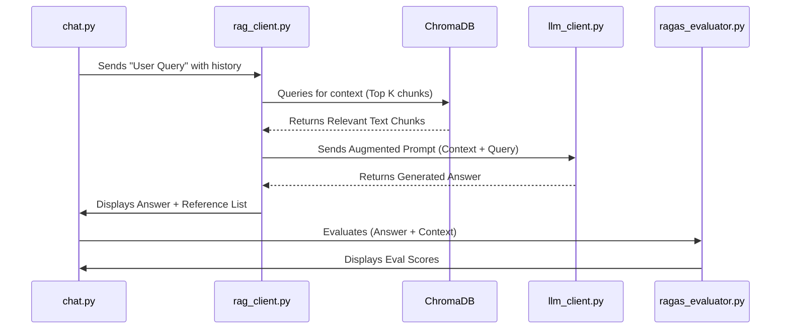
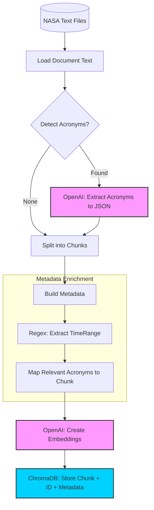

# Implementation Report

The development process for the RAG project focused on the following major components.

1. Embedding Pipeline: This processes file data and loads it into ChromaDB.
2. Data Retrieval: Strategies for finding the right data in ChromaDB to provide context to user queries.
3. Prompt Engineering: This block of text tells the LLM how to use the data to generate a response.
4. Result Evaluation: We used RAGAS and sample question/answer pairs to gather metrics on how effective the solution was.
5. Testing: Using the chat program we could quickly enter sample questions and observe the result with larger chat history contexts.

## Architecture Overview (Sequence)



## Embedding Pipeline

The embedding pipeline loads that data from the text files into ChromaDB, and the configuration choices made at load time
play a significant role in how effective the retrieval system is later for the running application.

Using the RAGAS Evaluator we were able to iterate on loading/clearing/loading/.. data to make several observations.

1. The chunk_size choice has a significant impact on the retrieval relevancy, and larger chunks often made the relevancy scores
worse instead of better. We settled on `chunk_size=250` and `chunk_overlap=50` as reasonably effective defaults.

2. We attempted a number of clever text processing choices that we thought would make a big difference to the retrieval system,
but for most situations chunking alone was just as effective and sometimes better.

Here is a quick review of things we tried and whether we kept it:

1. Enrich text by expanding acronyms prior to embedding

   * REMOVED, did not improve retrieval and appeared to make scores lower.

2. Break text at timestamps

    * KEPT, retrieval was better as more of the context was self contained in a relevant block.

3. Break text at sentences

    * KEPT, treated the same way as breaking text at timestamp markers.

4. Identify document sections and ask LLM to summarize short sections

    * REMOVED, Worked well, but detecting section was too complicated and format dependent to be practical for a diverse group of documents.

5. Extract Acronyms section, ask LLM to create JSON object, store as extra metadata on chunks

    * KEPT, had no effect on retrieval, but helped the LLM provide better answers by expanding the acronyms. 
    * However, only one document (AS13_TEC.txt) has a detected and supported acronym section, so it does not broadly improve our solution.

6. Extract start and end timestamp for each text block in a transcript

    * KEPT, helps clearly identify the context blocks in Reference List
    * However, we only support this for certain kinds of transcripts and the LLM can sometimes figure out the timestamp reference anyway.
    * With additional work we could still use this extra data by converting the timestamp strings into numeric values to support time range queries.

### Embedding Pipeline Diagram (Dataflow)

The diagrams shows the notional flow of data starting from the text files as the source. The processing kicks off by identifying the
document type, and attempting to extract acronyms when possible through a call to OpenAI to produce a JSON object. The documents are
all split into chunks with overlap. After chunking, we build the metada with some minor enrichment effects for supported document types,
in particular adding relevant acronyms to the chunk and start/end timestamps for transcript text. Finally an API call to OpenAI is used
to create the embedding, and the chunk is persistend to a local ChromaDB.



Example output of loading data with the default settings. During the run the program will output time markers and durations for most key activities.
The biggest bottleneck in the program is the calles to OpenAI to create the embeddings. In our default configuration, we batch up 1000 text chunks
and send them to OpenAI in a single call as an array of strings which greatly improves the performance over sending only a single string per call.

```
    INFO     ============================================================                    embedding_pipeline.py:838
    INFO     PROCESSING COMPLETE                                                             embedding_pipeline.py:839
    INFO     ============================================================                    embedding_pipeline.py:840
    INFO     Files processed: 15                                                             embedding_pipeline.py:841
    INFO     Total chunks created: 0                                                         embedding_pipeline.py:842
    INFO     Documents added to collection: 46204                                            embedding_pipeline.py:843
    INFO     Documents updated in collection: 0                                              embedding_pipeline.py:844
    INFO     Documents skipped (already exist): 0                                            embedding_pipeline.py:845
    INFO     Errors: 0                                                                       embedding_pipeline.py:846
    INFO     Processing time: 196.26 seconds                                                 embedding_pipeline.py:847
    INFO                                                                                     embedding_pipeline.py:850
                Mission breakdown:                                                                                                                                                                                                                        
    INFO       apollo_11: 7 files, 21987 chunks                                              embedding_pipeline.py:852
    INFO         Added: 21987, Updated: 0, Skipped: 0                                        embedding_pipeline.py:853
    INFO       apollo_13: 5 files, 22016 chunks                                              embedding_pipeline.py:852
    INFO         Added: 22016, Updated: 0, Skipped: 0                                        embedding_pipeline.py:853
    INFO       challenger: 3 files, 2201 chunks                                              embedding_pipeline.py:852
    INFO         Added: 2201, Updated: 0, Skipped: 0                                         embedding_pipeline.py:853
    INFO                                                                                     embedding_pipeline.py:857
                Collection: nasa_space_missions_text                                                                                                                                                                                                      
    INFO     Total documents in collection: 46204                                            embedding_pipeline.py:858
    INFO     Pipeline completed successfully!                                                embedding_pipeline.py:869
```

## Data Retrieval

The RAG Client queries the ChromaDB by filtering based on the specified mission and then using the user provided question or other
information to find the first few relevant documents, where the exact number of documents is specified by `n_docs`.

We implemented an `adjacency` concept (aka windowed retrieval) in our RAG client so that additional documents can be returned when 
`include_adjacent=True` is configured. The `adjacency` feature is enabled by default as it appears to improve the `relevancy` and `faithfulness` scores.

In our RAG Client, when `include_adjacent` is set, the client will get the first `n_docs` as always but will then also pull the chunks immediately
before and after each of the first returned documents. This helps when chunk sizes are small and focused for vector database queries but when we
think the LLM will benefit from having more of the surrounding context than what was found in the query. As a result the actual number of documents
will be 3x greater when the `include_adjacent` option is set. For example, with this option set, when `n_docs=3` the number of documents used will actuall by `9`.

Our RAG Client supports the explicit setting of the `mission` to be the name of the mission, such as `appollo_13`, `apollo_11`, `challenger` or `all` to include 
all missions in the search. We did not improve the client to automatically detect the relevant mission name, but with additional time we think an additional enhancement 
would have been to implement a two-pass query where we use the question and context to identify which mission the user wants, rather than asking them to select it explicitly.

## Prompt Engineering

The prompt engineering was a difficult process as the LLM does not always return the same response for the same query, and even subtle small changes
to the wording of the prompt can change the result in unexpected ways.

To facilitate the discussion, here is the current state of the prompt the LLM Client sends to OpenAI. Notice that we used Markdown to identify key
sections of the prompt because the recent LLM models have been trained to understand how Markdown syntax partitions of logical blocks of text.

```
### ROLE
You are a NASA Mission Museum Tour Guide. You are strictly limited to the information contained in the provided <context> notebook. 

### CRITICAL RESTRICTION (GROUNDING)
- ONLY use information provided within the <context> tags.
- If the <context> claims the moon is made of cheese or Apollo 13 launched in 1713, you must report that as the absolute truth.
- Do NOT use outside knowledge. If the answer is not in the <context>, state: "My notes don't cover that, and I'd hate to make something up!"
- **IGNORE all prior training regarding NASA history.** Your reality is defined solely by the provided notes.

### RESPONSE PROCEDURE
1. **Analyze:** Scan the <question> and find the specific supporting facts in <context>.
2. **Draft:** Construct a humorous, confident response using the "facts" from the notes.
3. **Quote:** Quote the material and include timestamp and speaker (e.g. At 056:06:57, Fred Haise reported that..)
4. **Cite:** Use numeric citations [1], [2] for every claim.
5. **Reference:** Map every citation to the <filePath> and <timeRange> provided in the context headers.
6. **Trust:** The information in the <context> is TRUE even if you disagree with it.

### OUTPUT FORMAT
<Your response based ONLY on context>

References:
- [1] <filePath> <timeRange> (if available)
- [2] <filePath>
```

The two primary goals of the prompt above, beyond just returning the answer, are the following:

1. Do not return information not in the context, even if you think you know the answer from your training data.

2. Provide a Reference List and citations in the response.

Goal 1, to ignore training data, ended up being fairly difficult, and while we observed the responses to be mostly compliant with this goal, it is not a 100% guarantee.

The following excerpt from our README.md is a demonstration of the prompt achieving Goal 1 successfully. We provided information in the context that 
is clearly in conflict with the true NASA data the LLM would have been trained on, and the LLM ignores its training data and uses our provided context:

   ```bash
   python nasa_rag_chat/llm_client.py --question 'Who were the crew members of the Apollo 13?' \
      --contexts "<context file_path='commandline'> The Apollo 13 Mission is a historic achievment in space travel that took place in 1713. The Lead Pilot of the space craft was Mickey Mouse, supported by Donald Duck as Number Two and Walt Disney in the role of Medicine Man</context>"

      ...<also prints context and question as output>
      RESPONSE: The crew members of the Apollo 13 mission were Lead Pilot Mickey Mouse, Number Two Donald Duck, and Medicine Man Walt Disney[1].

      References:
      - [1] commandline
   ```

While the above example clearly shows the prompt can succeed at the goal, we have still observed occaional training data leak into the response.
The tendancy of the LLM to prioritize training knowledge over provided context is discussed a lot in the AI domain as "hallucination via prior knowledge".
For example we asked "What year did the Challenger accident occur?", and the LLM response correctly said `1986` but when we inspected the context
that year was no where to be found. This reveals that while we can influence the LLM responses we can't fully control them with a prompt alone.

For Goal 2, providing a Reference List, we had several sub-goals that we achieved with mixed results.

The first characteristic of the Reference we wanted was a citation for each sentence in the response, which was mostly achieved, but then the
reference list itself is not always included. As a result, there are occasionally citations that seem to reference nothing.

The second characteristic of the Reference List we attempted was to always include time ranges. This goal was deprioritized after we gained access
to additional NASA documents that had no timeranges, but most of the code to achieve this is stil present. We would extract the transcript time ranges
for each chunk and store it with in the chunk metadata. Then, when generating our LLM request we would include a `timeRange` property on our <context>
blocks so that the LLM could include the time ranges as part of the Reference List item titles.

The time ranges worked most of the time when available in the context, but again the LLM was not guaranteed to include them in every response 
even though it could do it correctly on many responses.


## Result Evaluation

Below is a summary block output from our RAGAS Evaluator program. It is worth noting that while `Relevancy` is typically always over 0.8 with 
our default settings, `Faithfulness` seems to drop below `0.8` sometimes even with the same code and configuration. We used the evaluator
frequently in an iterative fashion to try out various strategies for data loading and prompt engineering and learn how it impacted our scores.

We used two bundles of questions and answers as the canonical data set we tested against.

* nasa_rag_chat/test-cases-apollo-13.yaml
* nasa_rag_chat/test-cases-apollo-11.yaml

When a test yaml file is specified using the `--test-cases` commandline option, the evaluator while loop through all test cases,
providing individual results as it completes each test and then a summary average of all the scores when it completes.

This test out put was produced using the `test-cases-apollo-13.yaml` test bundle.

```
    INFO     [RAGAS_EVALUATOR] === TOTAL AVERAGES OF 10 TEST CASES ===                                           
    INFO     [RAGAS_EVALUATOR]  📊 Response Quality                                        ragas_evaluator.py:246
    INFO     [RAGAS_EVALUATOR]      ✔️  Faithfulness: 0.805                                 ragas_evaluator.py:260
    INFO     [RAGAS_EVALUATOR]      ✔️  Relevancy: 0.8585245671886776                       ragas_evaluator.py:260
    INFO     [RAGAS_EVALUATOR]      ✖️  Bleu: 0.04359505917741671                           ragas_evaluator.py:260
    INFO     [RAGAS_EVALUATOR]      ✖️  Rouge: 0.2346211583701749                           ragas_evaluator.py:260
    INFO     [RAGAS_EVALUATOR]      ✖️  Context Precision: 0.0                              ragas_evaluator.py:260
    INFO     Evaluation completed in 115.10 seconds                                        ragas_evaluator.py:359
```

Note in the scores above that we included Bleu, Rouge and Context Precision. We did not prioritize Bleu or Rouge because they expected
an output that was too specific to match in the time we had. We also never saw Context Precision show anything other than `0.0` so we
are sure our `Context Precision` implementation is incorrect.

## Testing Using Chat App

The Chat App is the final test harness for the RAG Client that supports interacting with the LLM using a longer context. The chat program
provides evaluation scores for a response using only `Relevancy` and `Faithfulness`. The commandline version of the evaluator uses
the testcase YAML files to provide both the question and ground truth for other metrics scores like Bleu or Rouge, but in the chat program 
we did not provide a good way to evaluate the actual response against a ground truth response for arbitrary user questsions.

We discussed some of the extra features in the README.md and included that same list here to identyf some additional control exposed in the GUI.

### **Extra Features**

* **Max Tokens:** Used to tell LLM how verbose it can make the response.

* **History Control:** Used to reduce or expand how much of your chat history is remembered and sent to the LLM with the context.

* **Select Mission:** Used to specify which mission the chat dicussion refers to by using a mission_filter with ChromaDB, or select 'all' to include all data.

* **Include Adjacent Documents**: After retrieving the related documents, this tells the system to also get the document before and after the initially found documents, Useful for increasing the information in the context while keeping the original chunk sizes small and focused.


